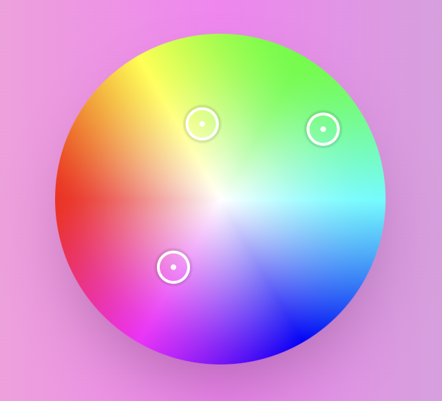

<div align="center">
  <a href="https://gradiently-demo.vercel.app/">
    
  </a>
</div>

# Gradiently

A minimal, lightweight colour picker to generate beautiful colours and gradients.


### Installation

```console
npm install gradiently
```

```console
yarn add gradiently
```

```console
pnpm add gradiently
```

### Basic Usage

```js
import { ColorWheel } from 'gradiently'
```

```js
const [gradient, setGradient] =  useState<string>("");

<ColorWheel
  radius={120}
  onChange={setGradient}
/>
```

### Advanced Usage

```js
const [gradient, setGradient] =  useState<string>("");

<ColorWheel
  radius={120}
  pickers={2}
  gradientType={'linear'}
  direction={'right'}
  onChange={setGradient}
/>
```

### Props

| Prop        | Type           | Default Value | Required? |
| ------------- | ------------- | ----------- | ----------|
| radius      | `number` | 100 | `no` |
| pickers     | `number` | 3 (max 3, min 1)  | `no` |
| onChange    | `(value: string) => void` |  | `yes` |
| gradientType | `linear` or `radial` | `linear` | `no`
| direction | `DirectionsIndex` | `right` | `no`

#### DirectionsIndex type
```js
import { ColorWheel, DirectionsIndex } from 'gradiently'
```
```js
type DirectionsIndex = "top" | "top right" | "right" | "bottom right" | "bottom" | "bottom left" | "left" | "top left"
```
